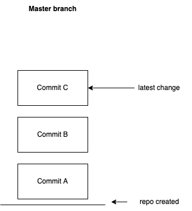
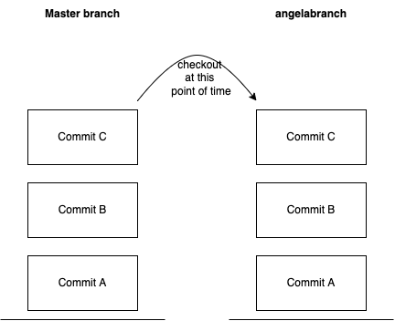
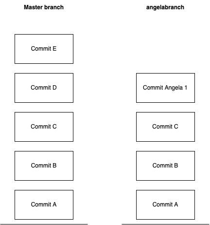
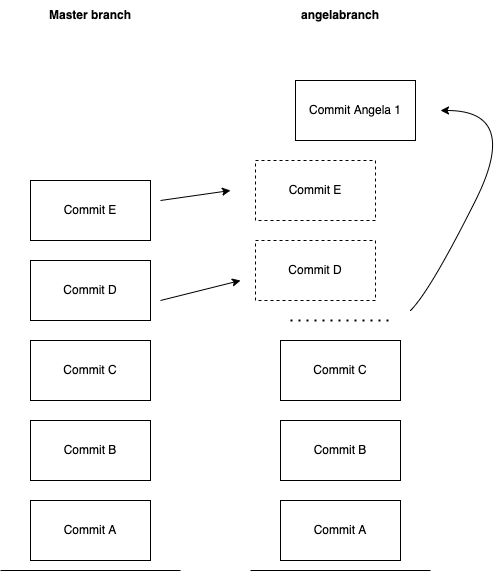
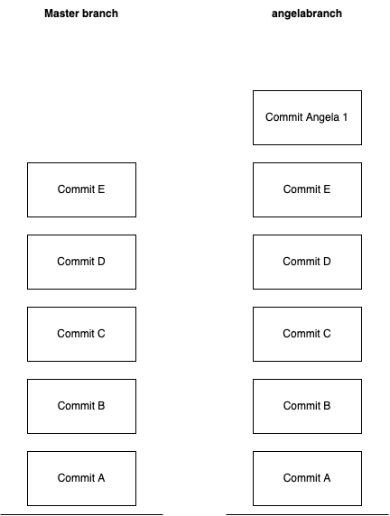
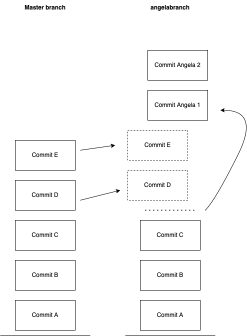
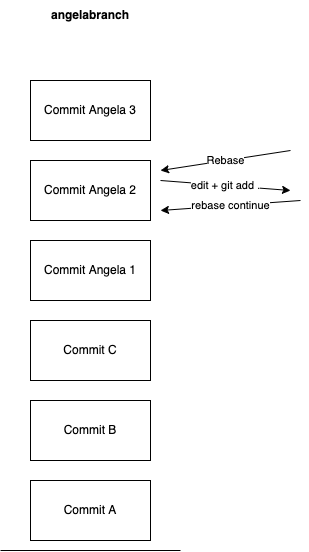

# Introduction to Git Rebasing
Allowing you to make cleaner commits and do some wild stuff. 

## What is Git Rebase ? 
To understand Git Rebase, we must first make sure there is a solid understanding of how Git broadly works. Git is a piece of software known as a **version control system**. Where version control systems allow the tracking and organization of changes made by multiple contributors for any particular project.  

**Github** is a service that hosts a collection of "**repos**", which can be thought of as invididual projects, for its users. These projects are stored as a collection of changes. Each change is called a '**commit**'. Additionally each repo can have many branches, which are copies/snapshots of the project at any given time.

A simple repo may have a 'master' branch that can be visualized like so: 



Commits are stacked on top of commits made in the past.

Usually users, who which to contribute to a repo, "checkout" a copy of the repo at the present point of time, and this becomes a "branch". `git checkout -b angelabranch'`. 



Now, as a user works, they create a commit containing their change. While they are working, more changes could have been made to master branch. And now the user's angelabranch is out of sync with master branch.



At this point the user is ready to put their changes in the master branch. However because of the underlying differences between the two project branches, this may not be possible without first taking action.

A user may choose to perform a: 
- **Merge** : take all the changes from branch A and creates a change commit of them in branch B.
- **Rebase**: replays unshared commits from branch B on top of branch A

Below is a visualization of rebase in action: 



Now the user's histories are equivalent and the user's changes are ready to be incorporated into master branch



One can even do this with MULTIPLE commits: 



## How to Rebase: 
In the visualized examples, we have two branches `master` and `angelabranch`. Let's assume, I'm ready to rebase `Commit Angela 3` on top of whatever is in the master branch.
```bash
# Make sure all your development work is commited on your branch 
# For this above example I would have written 'git commit -m "Commit Angela 3"'
git checkout master
git pull origin master
git checkout angelabranch
git rebase -i origin/master
```

In the above steps, we're 
1. switching our setup to look at the master branch
2. getting all the latest commits made on master from github.com and incorporating them into the version of master branch on our computer.
3. switching our setup to look at the angelabranch
4. issuing the command to interactively (`-i`) rebase the current branch onto the specified master branch

Hopefully, this command succeeds, and you see something like this in your terminal:  
`Successfully rebased and updated refs/heads/angelabranch.`

However, there is a chance that this will NOT go smoothly. For example, when master branch has a commit that modifies fileA.js and angelabranch has a commit that modifies fileA.js as well. Something called a "**Collision**" can occur and cause the interactive rebase to enter a different midway state. Example below: 

```
Auto-merging fileB.js
CONFLICT (content): Merge conflict in fileA.js
error: could not apply b451586772... Commit Angela 3
hint: Resolve all conflicts manually, mark them as resolved with
hint: "git add/rm <conflicted_files>", then run "git rebase --continue".
hint: You can instead skip this commit: run "git rebase --skip".
hint: To abort and get back to the state before "git rebase", run "git rebase --abort".
Could not apply b451586772... Commit Angela 3
```

But interactive mode is awesome, and if you read the error carefully, it tells you exactly what you need to do to continue. In this example: 
1. You need to resolve the conflict in fileA.js
2. (I personally like to test to make sure I haven't broken anything here)
3. `git add .` those changes
4. `git rebase --continue`

And if you're rebasing a SINGLE COMMIT that is all. Unless you missed a collision by reading through the error message to quickly, that is all. This command will succeed.

The reason I mention a single commit is because rebase applies commits one by one. If you're rebasing multiple commits, it will first apply the oldest commit, then the next oldest, etc, until it reaches the last commit on the user's branch.  So if you have 3 commits, each with collisions. You'll have to resolve collisions and `git rebase --continue` up to 3 times. 

## Alternative uses of Rebase
Rebase has a lot of other edge uses that can be helpful for keeping clean commits and simple history.

You can use rebase to [edit an individual commit](https://stackoverflow.com/questions/1186535/how-do-i-modify-a-specific-commit), even if that commit isn't the latest in the history.
```bash
# Edit the latest commit without rebase 
git add .
git commit --amend 

# Edit an earlier commit WITH rebase
git rebase -i @~<number of commits to look back on>
# the terminal will enter the interactive mode at this point. ; may need to type 'i' to edit, then est, :wq to save and quit
# pick Commit Angela 2
# change to
# edit Commit Angela 2 # (or whichever commit you want to edit)
#:wq
```
Which results in: 
```
Stopped at 6576223edb...  Commit Angela 2
You can amend the commit now, with

  git commit --amend 

Once you are satisfied with your changes, run

  git rebase --continue
```
So the above printed out next steps to return you to a good state are available.



Rebasing looks pretty cool and easy right? The answer is - mostly. If you intend to rebase, then you can take steps BEFORE you begin coding to keep it simple. If you're rebasing instead of merging as an after thought tho, it has the potential to be a pretty long process.

## Musts and best practices: 
- **MUST NEVER DO** [**you should NEVER rebase a branch that is being used, or branched off of, by other people**](https://www.atlassian.com/git/tutorials/merging-vs-rebasing#the-golden-rule-of-rebasing)
  - Brief reason why : Rebasing CHANGES your commit's SHA (think of this like a Github hash for keeping track of commits) (in the above visualized examples the changed SHAs would be on `Commit Angela 1` and `Commit Angela 2`, and any subsequent Commits made after `Commit Angela 2`). SHAs are used in keeping track of commits, so if you change them, you change the history. And if you change the history in a way that's incompatable with the other people using that shared branch - to keep it simple, you **WILL** break them.
- **HELPFUL** Use interactive mode `-i` . There is no reason not to. If you encounter something weird, the command will walk you through how to resolve it. 
- **HELPFUL** During development, prior to rebasing, it is helpful to:
  - Keep your changes in one commit
  - Keep all changes related to a file in one commit
