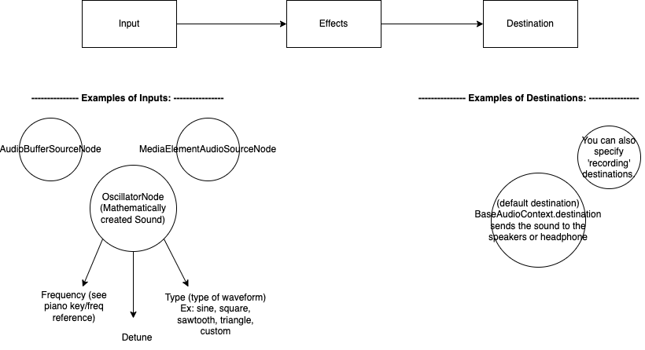

# Exploring Audio support in web browser, beyond just the basics:

## Resources: 
- [Web Audio Api docs](https://developer.mozilla.org/en-US/docs/Web/API/Web_Audio_API)
- [Piano frequencies (Hz) and MIDI keys](https://en.wikipedia.org/wiki/Piano_key_frequencies)
- [Create the actual sound with OscillatorNode](https://developer.mozilla.org/en-US/docs/Web/API/OscillatorNode)
- [Simple Synth Mozilla Demo](https://developer.mozilla.org/en-US/docs/Web/API/Web_Audio_API/Simple_synth)
- [Technical Breakdown of MIDI file format](http://www.music.mcgill.ca/~ich/classes/mumt306/StandardMIDIfileformat.html)
- [MIDI human readable parser util](https://github.com/colxi/midi-parser-js)

## Overview of how Audio works with web audio api:


## Making a sound
```javascript
//Need to setup an AudioContext to make use of the web audio api features
let audioContext = new AudioContext();
let mainGainNode = audioContext.createGain(); //Think of 'gain' as Volume 
mainGainNode.connect(audioContext.destination); //In order for sound to happen we must be connected to the computer's speaker system or headphones.
mainGainNode.gain.value = 2 //Set the volume to something other than 0

//Begin the sound creation
const osc = audioContext.createOscillator(); //Create a new "input", mathematically
osc.type = "sine" //All sounds are waves, and we're giving this one a 'sine' wave
osc.frequency.value = 440 //440 is a frequency in Hz that represents the "A" tone (middle of piano)
osc.start(); //Begin making the noise detailed above
//osc.stop(); //sometime later (maybe you have this connected to mouseup or mousedown), STOP making the noise.
```

## MIDI file format
<placeholder>

## Playing MIDI files in the browser
<placeholder>

http://www.cs.cmu.edu/~music/cmsip/readings/Standard-MIDI-file-format-updated.pdf

midi files always start with a header chunk, then one or more track chunks
Header Chunk = <chunk type><length><format><ntrks><division>
//http://www.music.mcgill.ca/~ich/classes/mumt306/StandardMIDIfileformat.html#:~:text=MIDI%20Files%20contain%20two%20types,up%20to%2016%20MIDI%20channels.
Where <chunk type> is 4 ascii characters
Where <length> is a 32 bit representation of the number 6
Where <format> is a 16bit (2 byte) describes file org. It can be either 0, 1, or 2.  
    0 - file contains a single multi-channel track
    1 - file contains one or more simultaneous tracks
    2 - the file contains one or more sequentially independent single-track patterns
Where <ntrks> is number of track chunks in file (if format is 0, this will be 1)
Where <division>, is delta times; 
    0 - bits 14-8 are ticks per quarter-note
    1 - bits14-8 are negative smpte format; bits 7-0 are ticks per frame.

There are 3 types of events: 
- **MIDI Channel Events** : These are the events that cause audible changes. Things like Note on and Note off.
- **System Exclusive Events** : These are special events for hardware or software that defines a spec for which the event should conform.  For the purpose of this demo, we're just gonna pretend these don't exist.
- **Meta Events** : These are events more related to meta-data or supplemental. Think text, comments, copyright, track name, instrument name, lyrics, 

Tempo: rate at which notes are played. ["by default the time signature is 4/4 and tempo is 120 beats per min."](https://sites.uci.edu/camp2014/2014/05/19/timing-in-midi-files/)
4/4 = four quarter notes per bar (midi default) from [here](https://majicdesigns.github.io/MD_MIDIFile/page_timing.html#:~:text=A%20MIDI%20quarter%20note%20normally,you're%20in%204).):
Quarter note === beat
meta events can specify a change in tempo
tempo is expressed as a 24-bit number that designates microseconds per quarter-note

Looks like audioContext.currentTime can be used to keep tick time. 