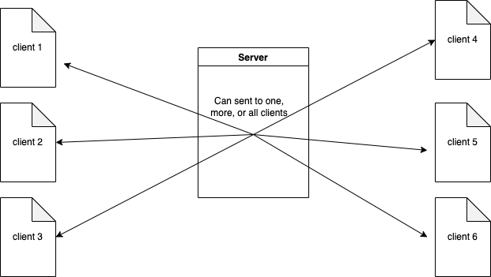
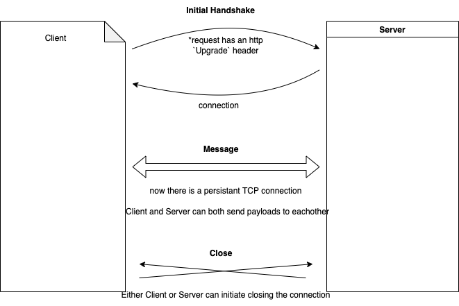

# Websockets
A javascript API, that makes use of the underlying WebSocket communications protocol, which allows two way real-time communication between client and server over an open and persistant connection, without the overhead incured by polling.

## How to Websockets work? 
Broadly speaking, 
- a client/browser initiates a request to a server with an `Upgrade` HTTP Header. 
- The server either allows or disallows the connection and replies to the client with its decision.
- From here a persistent connection exists and messages can be sent using a protocol different from the usual HTTP methods (get/post) you may be used to: 
  - from client to server
  - from server to client
- In addition to communication between a client and a server, additionally a server can broadcast messages to multiple clients.
- The persistent connection is closed when requested by either client or server.

## When to use Websockets?
- as a replacement for HTTP polling
- good for small and big messages/payloads

## Example
For this example, let's imagine a simple ephemeral realtime chat application.
In this example we'll have a backend endpoint that receives messages and adds them to a list
We will also have a websocket setup to push new messages to the client

## Example backends:
### Nodejs
- https://github.com/aml2732/landl-topics/tree/main/websockets-intro/servers/node-example
- makes use of two npm modules [ws](https://www.npmjs.com/package/ws) and websocket
- There also exist other libraries that can be used
  - [socket.id](https://www.npmjs.com/package/socket.io)
### Python

## Example client/frontends:
### Vanilla JS
- https://github.com/aml2732/landl-topics/tree/main/websockets-intro/frontends/vanilla-js-example
- makes use of https://developer.mozilla.org/en-US/docs/Web/API/WebSockets_API
### React
- https://github.com/aml2732/landl-topics/tree/main/websockets-intro/frontends/react-example/test-webhooks-app
- uses raw websockets (like we did for Vanilla JS), but shows how you can do so within the context of a simple react application.
- Alternative libraries exist if you want to not deal with websockets on that granular of a level.
  - [socket.io-client](https://www.npmjs.com/package/socket.io-client)
  - [react-use-websocket](https://www.npmjs.com/package/react-use-websocket)

## Security: 
While websockets can be used casually for proof of concept chat app style work; if you're going to use them in a production environment, it is essential that you use some security checks to control access to that websocket.
1. Firstly connect via wss; NOT ws. The protocol "wss" establishes an encrypted connection; vs "ws" which is an unencrypted connection.
2. Secondly, in the initial client->server connection request, send either an auth token / auth headers or a cookie for the server to check
    - For nodejs it is recommeneded to handle this during the Upgrade request and destroy the socket if auth fails
    - For python here are some auth examples for the library I used earlier: https://websockets.readthedocs.io/en/stable/topics/authentication.html
3. Thirdly, you must authenticate the Origin header. Websockets are not limited by same origin policy.
4. Unrelated to websockets, it may be a good idea to use an algo to encrypt auth token

## Notes: 
- supported by all modern common browsers
- use of HTTP `Upgrade` Header is the signifier for browser to use WebSocket protocol instead of HTTP

## Resources used to create this presentation:
- https://developer.mozilla.org/en-US/docs/Web/API/WebSockets_API
- https://en.wikipedia.org/wiki/WebSocket
- https://dev.to/codesphere/getting-started-with-web-sockets-in-nodejs-49n0
- https://www.npmjs.com/package/ws#user-content-multiple-servers-sharing-a-single-https-server
- https://www.pluralsight.com/guides/using-web-sockets-in-your-reactredux-app
- https://websockets.readthedocs.io/en/stable/intro/index.html
- https://www.alanwsmith.com/posts/setup-a-python-flask-web-server-with-websockets--20eo3p4t928f
- And a few others.

### Writing notes: 
- wikipage under security considerations
- 
