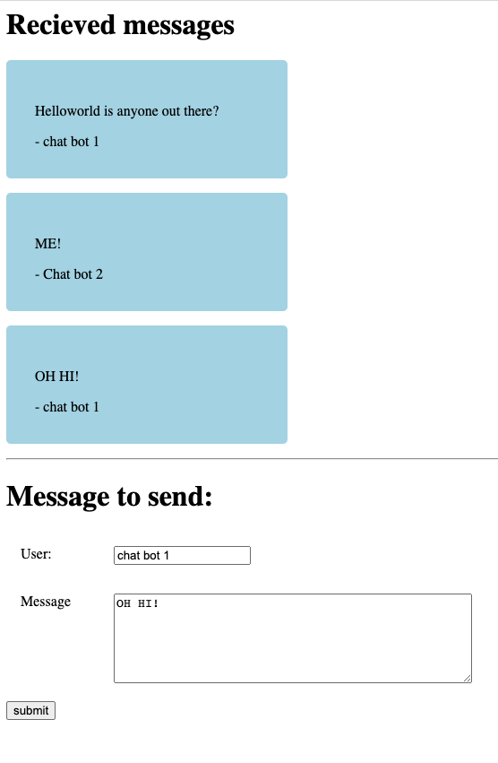

# Setup:

Built to work with node-example server. 
simply open index.html in the browser with its absolute path. ex: 
file:///Users/angela/.../landl-topics/websockets-intro/frontends/vanilla-js-example/index.html

# Preview: 

